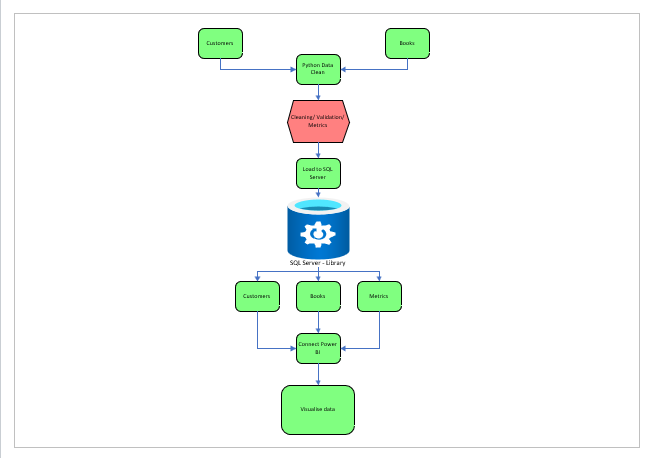
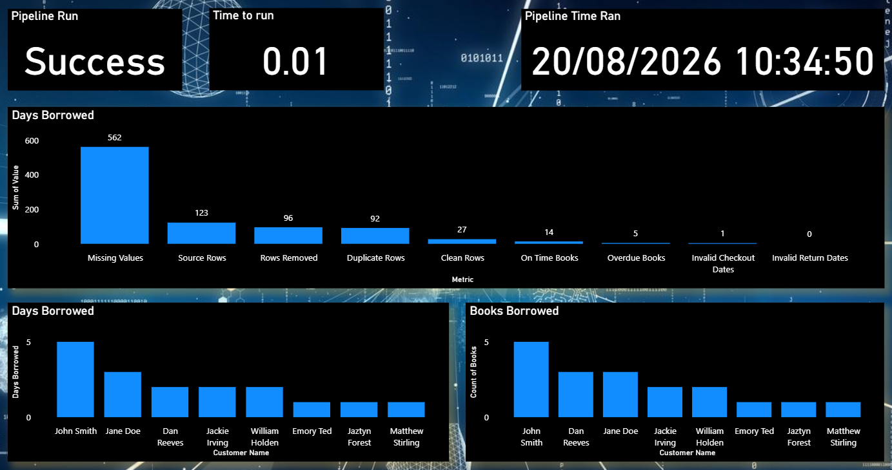

# DEL5A5.1_17.08.2026

# Library System Data Engineering Pipeline

## 1. Project Overview

This project implements a data engineering pipeline for a library system. Raw customer and book CSV files are cleaned using Python/Pandas, quality and processing metrics are generated, cleaned data is loaded into SQL Server, and the resulting data is visualised in Power BI.

The objective of the solution is to create a repeatable data pipeline that:

- Imports raw library customer data.
- Imports raw library book data.
- Cleans missing and invalid data.
- Standardises column names.
- Converts dates into usable date formats.
- Calculates the number of days books were borrowed.
- Identifies overdue books.
- Tracks data quality and pipeline performance metrics.
- Stores the cleaned datasets in SQL Server.
- Provides data for analysis and visualisation in Power BI.

### Solution Architecture



### Proposed Power BI Report




## 2. Choices Made and Why

- **Python/Pandas** – efficient for CSV processing and data cleaning.
- **SQL Server** – provides structured relational storage and allows SQL querying.
- **Docker** – provides a reproducible environment for running the Python pipeline.
- **Docker volumes** – allow cleaned files to persist between containers.
- **Power BI** – provides visualisation and reporting.
- **Git/GitHub** – provides version control and project tracking.


## 3. Data Cleaning

`csv_cleaner.py` performs the following operations:

- Removes missing rows.
- Detects duplicate rows.
- Renames the checkout column.
- Converts dates to datetime.
- Converts borrowing periods from weeks to days.
- Calculates days borrowed.
- Identifies overdue books.
- Creates cleaned CSV files.
- Generates data engineering metrics.


## 4. Data Engineering Metrics

The pipeline tracks:

- Source row count
- Clean row count
- Rows removed
- Missing values
- Duplicate rows
- Invalid dates
- Overdue books
- Books returned on time
- Pipeline processing time
- Pipeline status

The metrics are saved as:

`data_engineering_metrics.csv`

and loaded into the SQL Server table:

`DataEngineeringMetrics`


## 5. SQL Server & Power BI

The cleaned tables and data engineering metrics are loaded into the local SQL Server `library` database.

The following tables are created:

- `Customers`
- `Books`
- `DataEngineeringMetrics`

Power BI connects to the SQL Server database and uses these tables to create visualisations and reports.


## 6. How to Run the Pipeline

### Step 1 – Clean the data

Run:

```bash

python csv_cleaner.py

python sql_loader.py

## csv_cleaner.py creates the cleaned CSV files and metrics.

## Then sql_loader.py loads the cleaned datasets into tables in the SQL Server

## Then Power BI collects the data to provide visuals.